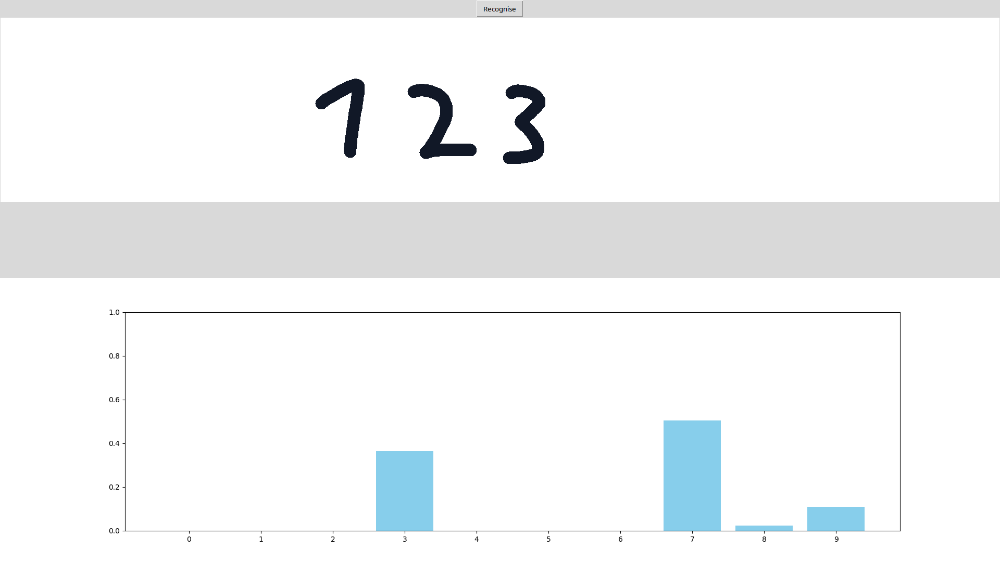

# CharacterRecognisionAI
# How to run
## Run the code
If you want to run the code just follow these steps:
- Download this [file](https://github.com/HarzIV/CharacterRecognisionAI/archive/refs/heads/main.zip) and extract it.
- Open the the folder in vscode and create a virtual envirounment with python version 3.12.
- Install the dependencies from the requirements.txt
- Run the GUI.py file.
## Windows specific
If you are on windows you can download this [file](https://github.com/HarzIV/CharacterRecognisionAI/archive/refs/heads/main.zip) and extract it. TThen simply run the AI.exe file.
# Important Info
You can enter characters by pressing down left click and dragging the mouse over the canvas.

The canvas is the upper field.
If you want to delete the numbers in the canvas simply double rightclick into it.  
The different number CANNOT tough each other, otherwise the preprocessing breaks.