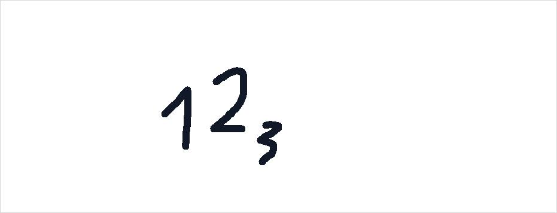

# Why Does the Image Get Transposed?
The captured image gets transposed, because this effectively swaps the x and y axis. This means that when the connectedComponents algorithm gets aplied it will be like it is scanning the image coloumn by coloumn and then row by row. This means that the height of the characters in the image does not deternmine in what order they get found. For example in this image:

Here this would lead to the algorithm first encountering the number 2 and therefore labeling it, with the number 1. But since it is usefull for the rest of the code, if the order of the groups also matches the order of the characters from left to right, the image is transposed. This then means that this does not become an issue, with the types of characters that are used here.